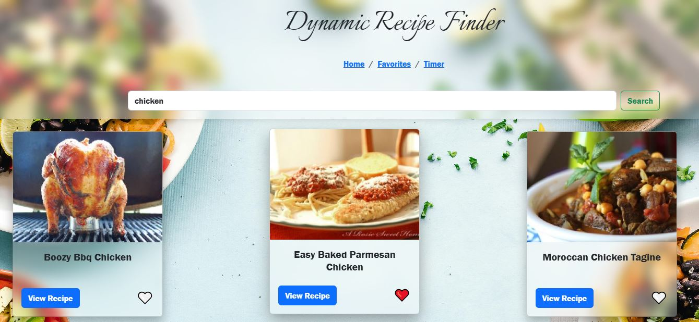
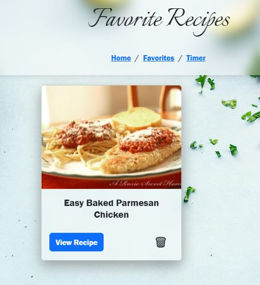
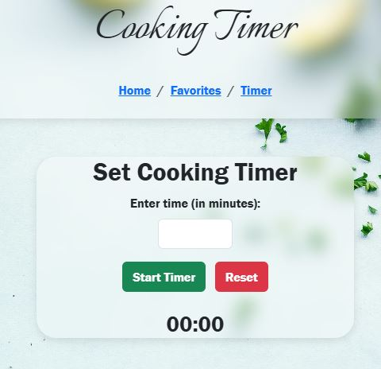

# Dynamic Recipe Finder

  

  
## Description

For this Dynamic Recipe Finder, the final project in Web Application Programming I, there are many implementations. It allows the users to search for a recipe based on the ingredients a user inputs, by using the [spoonacular API](https://spoonacular.com/food-api). Then, when the results queue, the user may view the recipe, or add it to favorites by clicking the heart to save them to favorites using local storage. The user can then go to the favorites page to view saved recipes, and remove them if necessary. There is also an integrated timer for cooking, if a user decides they would like to use this functionality.

My motivation for this project was for completing the final assignment in Web Application Programming. I wanted to use skills that I had previously used, and to create a sleek a modern design for this application.

  
## Table of Contents

1. [Description](#description)  
2. [Video Demonstration](#Demo)
3. [How to Use](#usage)  
4. [Licensing](#license)  
5. [Contributions](#contributions)  
6. [Contact Me](#questions)

## Demo

To watch a short video demonstration via youtube, click here.

## Usage

1. First Go to the website, and type ingredients into the search bar, and then click search. Once the recipes queue, you may favorite or view the recipes.

2. Now, you can view the favorites page, and recipes you favorite, will be saved to here from local storage.

3. Lastly, if the user finds it necessary, there is a timer with built in functionality to start, and reset using minutes as applicable. 

## Contributions

### Special thanks to the following libraries, languages, and tools:

- [Spoonacular API](https://spoonacular.com/food-api)
- [Bootstrap v5](https://getbootstrap.com/)
- [CSS](https://developer.mozilla.org/en-US/docs/Web/CSS)
- [HTML5](https://developer.mozilla.org/en-US/docs/Web/HTML)
- [JavaScript](https://developer.mozilla.org/en-US/docs/Web/JavaScript)
- [Axios](https://axios-http.com/docs/intro)
- [localStorage](https://developer.mozilla.org/en-US/docs/Web/API/Window/localStorage)
- [Pexels for non-copyright images](https://www.pexels.com/)

## License

The software license selected for this application *is as follows*:

**Massachusetts Institute of Technology License**

[MIT](https://opensource.org/licenses/MIT)

## Questions

If you have any additional questions you can contact me by using the following:

 Github Profile: [Goobergreve09](https://www.github.com/Goobergreve09)

 Email Address: gregory.greve@yahoo.com

